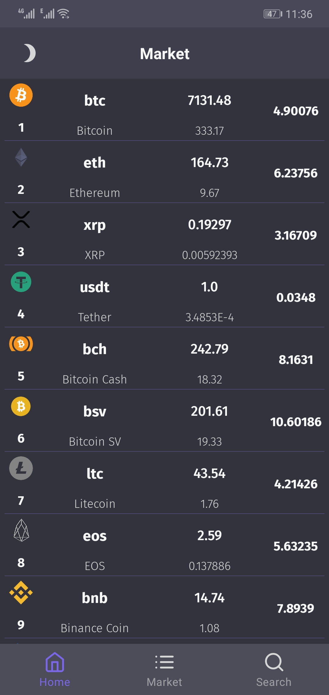
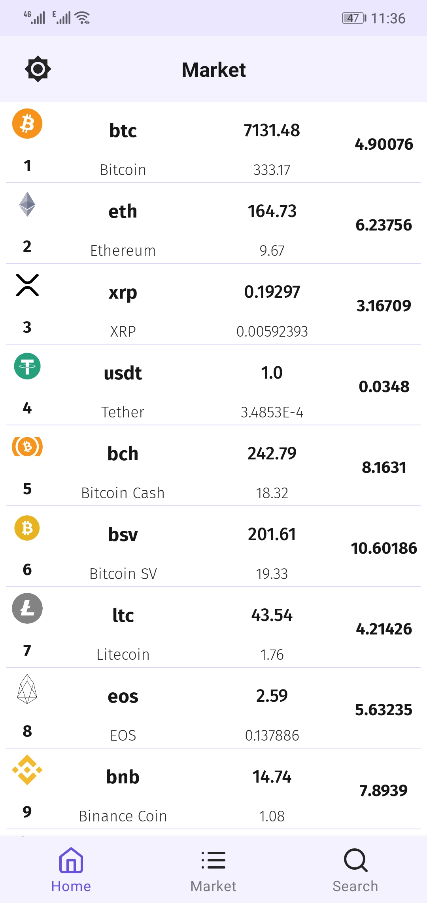
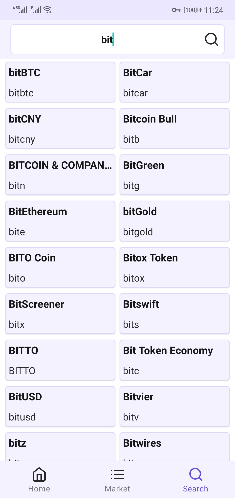

#### Android Arch Sample
A Sample app for implementing Clean Architecture with MVVM and Repository pattern using jetpack libraries.
It is a simple app, gets list of cryptocurrency coins from coingecko api, save to database and show to user.

### Features
* Kotlin
* Clean Architecture: Keep In mind, clean architecture starts from domain layer by implementing business logic(data models and abstract repository interfaces). so domain layer says to data layer what it should do and also domain layer provides proper data for UI layer.
* Repository Pattern: This pattern act on data layer. Repository Pattern Wraps around those data that provide by "BOTH network and Database". If your data provides only by network or only by database you can omit repository and do relavant tasks in UseCase.
* MVVM Design Pattern: this design act on Presentation layer, no problem with configuration changes :)
* Data Binding: Databinding is in favor of MVVM design pattern and its principal that UI should only show data.
* Kotlin Coroutines and Flow for concurrency and stream and receive data.
* Room For Data Persistence. I also plan to use realm to show one major benefit of archtecting an app(if we change data layer, other layer does not need to change. 
* Dagger2 for DI. Hint: I don't use dagger android because it is not so usefull and also it does not support and update any more. 
* Jetpack libraries and Navigation Component
* Dark Mode
* I used CoinGecko Free Api for coins list. https://www.coingecko.com/en
